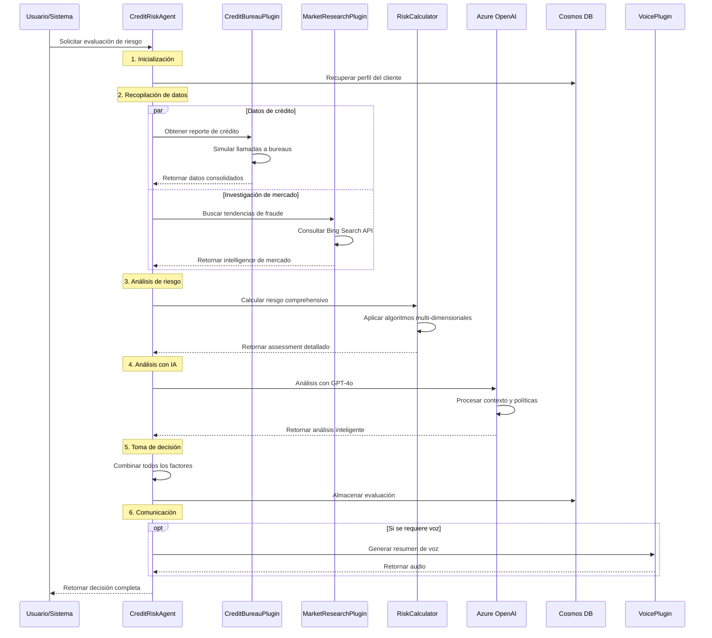
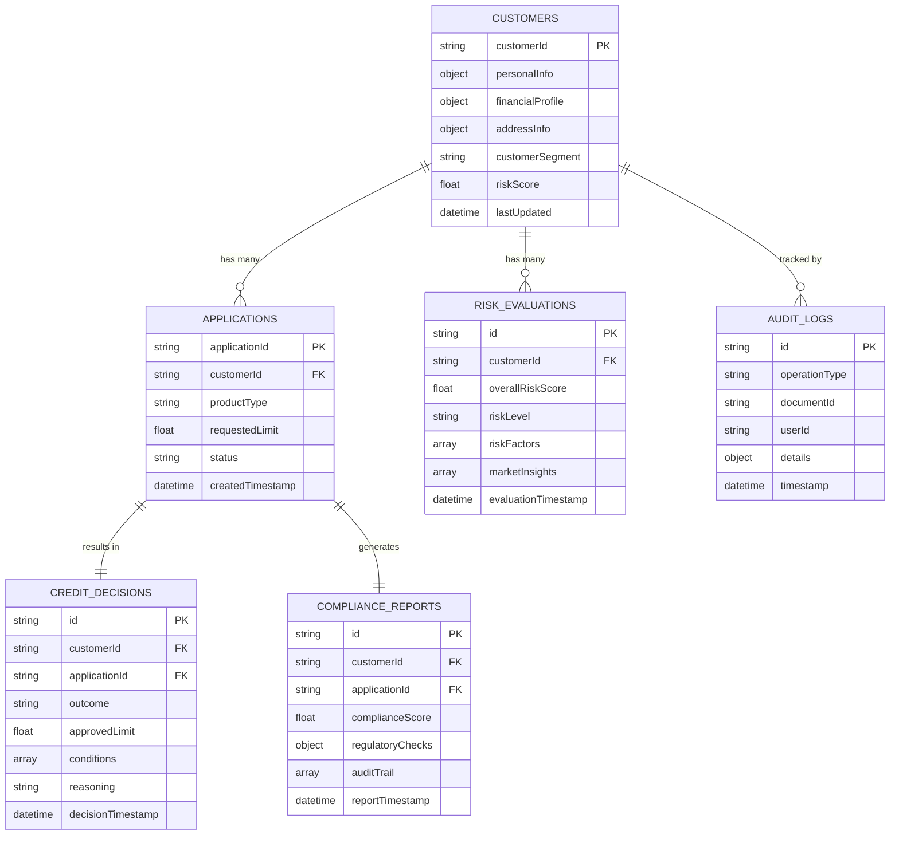
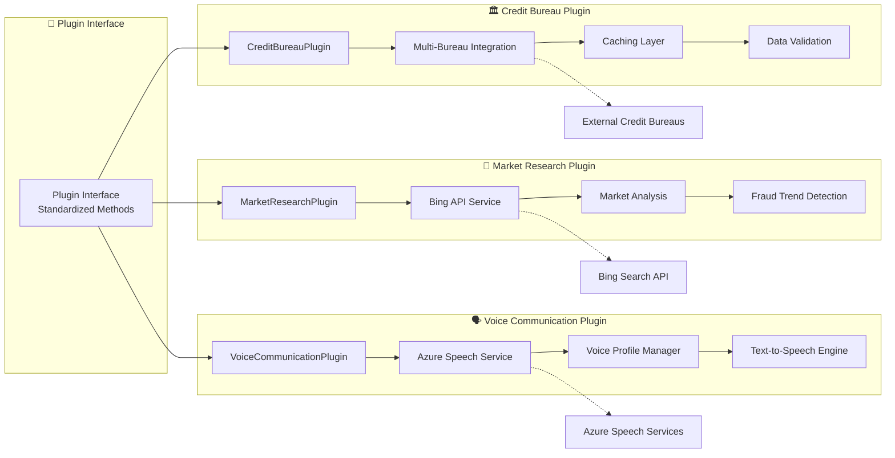
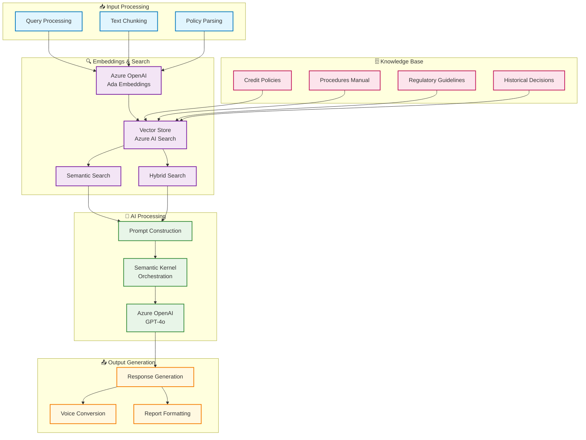
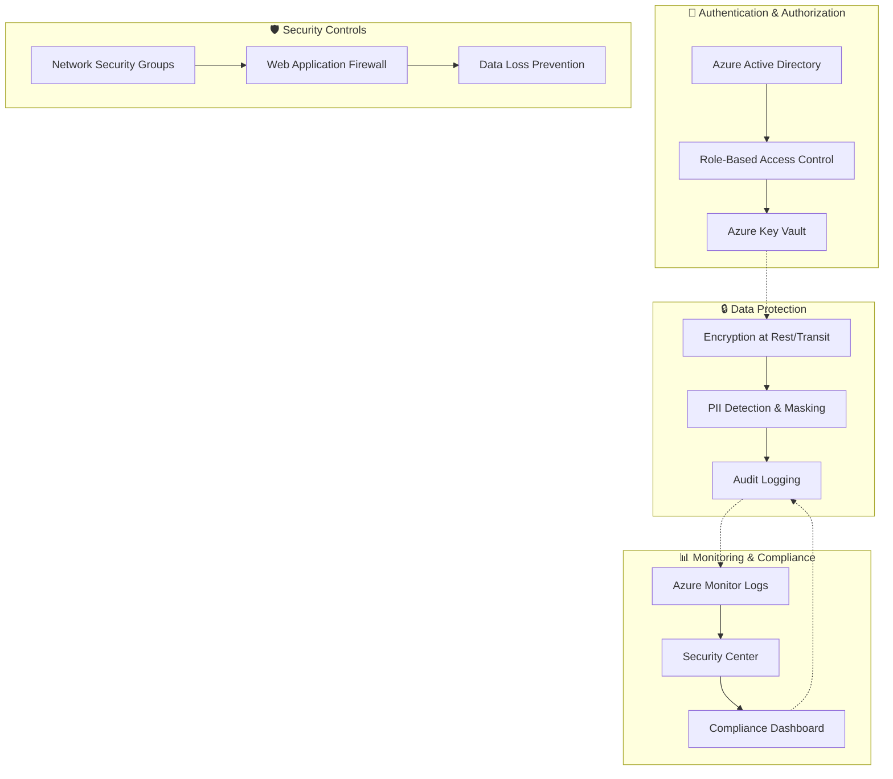
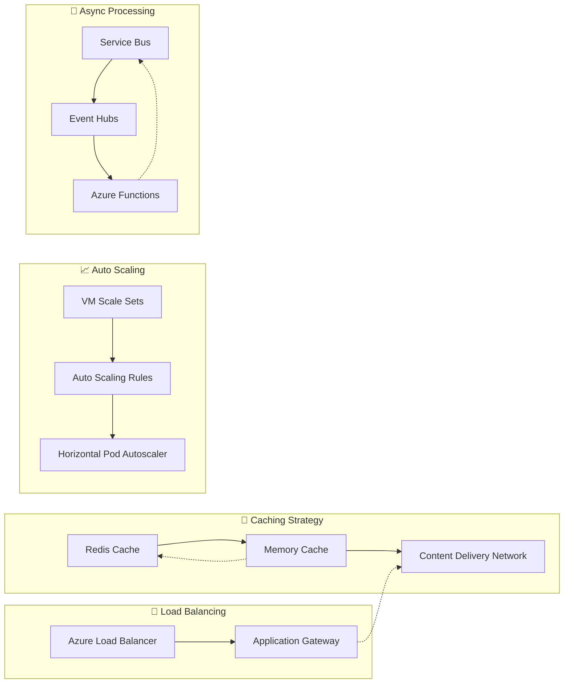
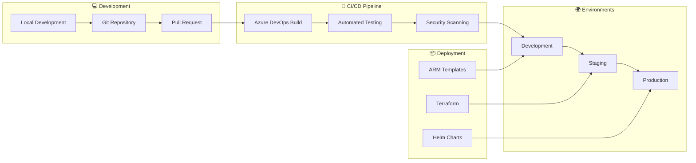

# 🏗️ Arquitectura del Sistema CreditGuard AI Assistant

**Instructor:** Steven Uba - Azure Digital Solution Engineer - Data and AI  
**Versión:** 1.0.0  
**Fecha:** Diciembre 2024

---

## 📊 Diagrama de Arquitectura General

```mermaid
graph TB
    %% External Systems
    subgraph "🌐 Sistemas Externos"
        CB[Credit Bureau APIs<br/>Experian, Equifax, TransUnion]
        BING[Bing Search API<br/>Market Intelligence]
        BUREAU[Bureau de Crédito API<br/>Simulado]
    end

    %% User Interface Layer
    subgraph "💻 Capa de Presentación"
        VS[VS Code<br/>Development Environment]
        JUP[Jupyter Notebooks<br/>Analysis & Testing]
        CLI[Azure CLI<br/>Deployment & Management]
    end

    %% Application Layer
    subgraph "🤖 Capa de Aplicación"
        AGENT[CreditRiskAgent<br/>Orchestrator Principal]
        
        subgraph "🔌 Plugins"
            CBP[CreditBureauPlugin<br/>Datos de Crédito]
            MRP[MarketResearchPlugin<br/>Inteligencia de Mercado]
            VCP[VoiceCommunicationPlugin<br/>Text-to-Speech]
        end
    end

    %% Business Logic Layer
    subgraph "⚙️ Capa de Lógica de Negocio"
        RC[RiskCalculator<br/>Algoritmos de Riesgo]
        SK[Semantic Kernel<br/>AI Orchestration]
        RAG[RAG System<br/>Retrieval Augmented Generation]
    end

    %% Azure AI Services Layer
    subgraph "🧠 Azure AI Services"
        AOI[Azure OpenAI<br/>GPT-4o & Ada Embeddings]
        AIS[Azure AI Search<br/>Vector & Semantic Search]
        SPEECH[Azure Speech Services<br/>Text-to-Speech]
        FOUNDRY[Azure AI Foundry<br/>Agent Service]
    end

    %% Data Layer
    subgraph "🗄️ Capa de Datos"
        COSMOS[Azure Cosmos DB<br/>NoSQL Database]
        STORAGE[Azure Blob Storage<br/>Documents & Media]
        CACHE[In-Memory Cache<br/>Embeddings & Results]
    end

    %% Infrastructure Layer
    subgraph "☁️ Infraestructura Azure"
        VM[Azure Virtual Machine<br/>Data Science VM Ubuntu]
        VNET[Virtual Network<br/>Secure Networking]
        KV[Azure Key Vault<br/>Secrets Management]
        MONITOR[Azure Monitor<br/>Logging & Analytics]
    end

    %% Connections
    VS --> AGENT
    JUP --> AGENT
    CLI --> VM

    AGENT --> CBP
    AGENT --> MRP
    AGENT --> VCP
    AGENT --> RC
    AGENT --> SK

    CBP --> CB
    CBP --> BUREAU
    MRP --> BING
    VCP --> SPEECH

    SK --> AOI
    RAG --> AIS
    RAG --> AOI

    AGENT --> COSMOS
    AGENT --> STORAGE
    AGENT --> CACHE

    AOI --> FOUNDRY
    AIS --> FOUNDRY

    VM --> VNET
    AGENT --> KV
    AGENT --> MONITOR

    %% Styling
    classDef external fill:#ffebee,stroke:#d32f2f,stroke-width:2px
    classDef ui fill:#e3f2fd,stroke:#1976d2,stroke-width:2px
    classDef app fill:#f3e5f5,stroke:#7b1fa2,stroke-width:2px
    classDef business fill:#fff3e0,stroke:#f57c00,stroke-width:2px
    classDef ai fill:#e8f5e8,stroke:#388e3c,stroke-width:2px
    classDef data fill:#fce4ec,stroke:#c2185b,stroke-width:2px
    classDef infra fill:#f1f8e9,stroke:#689f38,stroke-width:2px

    class CB,BING,BUREAU external
    class VS,JUP,CLI ui
    class AGENT,CBP,MRP,VCP app
    class RC,SK,RAG business
    class AOI,AIS,SPEECH,FOUNDRY ai
    class COSMOS,STORAGE,CACHE data
    class VM,VNET,KV,MONITOR infra
```

---

## 🔄 Flujo de Procesamiento de Evaluación de Riesgo

---

## 🏛️ Arquitectura de Datos

---

## 🔌 Arquitectura de Plugins

---

## 🧠 Arquitectura de IA y RAG

---

## 🛡️ Arquitectura de Seguridad y Compliance

---

## ⚡ Patrones de Rendimiento y Escalabilidad

---

## 🚀 Pipeline de Deployment

---

## 📚 Componentes Técnicos Detallados

### 🤖 CreditRiskAgent
- **Función**: Orchestrador principal del sistema
- **Responsabilidades**:
  - Coordinación de plugins
  - Evaluación integral de riesgo
  - Toma de decisiones automatizada
  - Generación de reportes de compliance

### 🔌 Sistema de Plugins
- **CreditBureauPlugin**: Integración con bureaus de crédito
- **MarketResearchPlugin**: Inteligencia de mercado en tiempo real
- **VoiceCommunicationPlugin**: Síntesis de voz para comunicaciones

### 🧠 Azure AI Services
- **Azure OpenAI**: GPT-4o para análisis y Ada-002 para embeddings
- **Azure AI Search**: Búsqueda vectorial y semántica
- **Azure Speech Services**: Text-to-speech multiidioma

### 🗄️ Persistencia de Datos
- **Azure Cosmos DB**: Base de datos NoSQL para datos transaccionales
- **Azure Blob Storage**: Almacenamiento de documentos y media
- **Azure AI Search**: Índices vectoriales para RAG

### ⚙️ Lógica de Negocio
- **RiskCalculator**: Algoritmos avanzados de scoring
- **Semantic Kernel**: Orchestración de IA
- **RAG System**: Retrieval Augmented Generation

---

## 🏷️ Ubicación del Archivo

**📍 Guardar como:** `docs/architecture.md`

Este diagrama proporciona una visión completa de cómo todos los componentes del sistema CreditGuard AI Assistant se conectan e interactúan, facilitando la comprensión tanto para estudiantes como para implementadores del sistema.